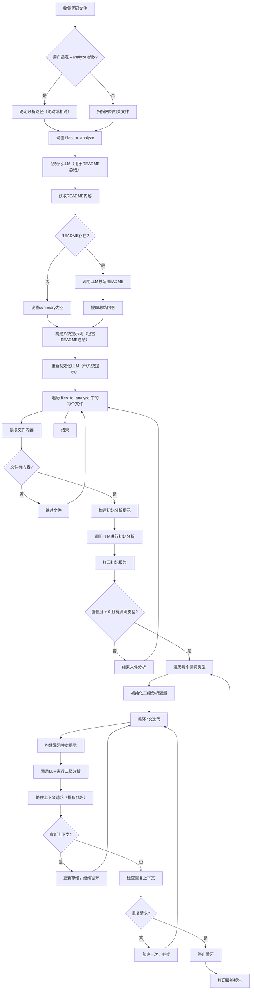

> zznQの捉虫日记
  我偶尔对感兴趣的软件进行安全研究。
  这里会记录下我捉虫的思路，大多数会很水，但希望能越捉越好。
  主要为：Research(internal, tools)、BUG等。

# Research

## vulnhuntr workflow

> [vulnhuntr](https://github.com/protectai/vulnhuntr) 基于 llm+静态分析 来挖掘 Python 项目安全漏洞。



## String Comparison Timing Attack

> [CWE-1254: Incorrect Comparison Logic Granularity](https://cwe.mitre.org/data/definitions/1254.html)

**What happened to the Go built-in `==`?**

```go
func Check(a, b string) bool {
	return a == b
}
```
分析编译 `go build -gcflags="-S" main.go`，简化汇编如下：
```
0x0000 00000 TEXT    main.Check(SB), ABIInternal, $48-32
...
0x0020 00032 PCDATA  $3, $1
0x0020 00032 CMP     R3, R1
0x0024 00036 BEQ     48
0x0028 00040 MOVD    ZR, R0
0x002c 00044 JMP     64
0x0030 00048 MOVD    R1, R3
0x0034 00052 MOVD    R2, R1
0x0038 00056 MOVD    R3, R2
0x003c 00060 PCDATA  $1, $1
0x003c 00060 CALL    runtime.memequal(SB)
0x0040 00064 MOVD    -8(RSP), R29
0x0044 00068 MOVD.P  48(RSP), R30
0x0048 00072 RET     (R30)
...
```
对比长度，如果长度相等就再使用运行 runtime.memequal 进行比较字符串。
```
0x0020 00032 CMP     R3, R1
0x0024 00036 BEQ     48
```
go 源码中有根据不同CPU架构去实现 `runtime.memequal` 函数 `src/internal/bytealg/equal_*.s`
这里以arm64为例：[equal_arm64.s](https://github.com/golang/go/blob/master/src/internal/bytealg/equal_arm64.s)

在性能上有高度优化，early-exit机制使其容易受到时序攻击，比如零长度，相同指针，不同长度快速返回；在对字节块比较时不相同时退出等。

改进：
1. 使用 `crypto/subtle.ConstantTimeCompare` 进行安全比较
2. 避免直接使用 `==` 或 `bytes.Equal` 比较敏感数据


## Symbolic Execution

- [Symbolic Execution](https://docs.angr.io/en/latest/core-concepts/symbolic.html)
- Go白盒符号执行：将IR(SSA)转换为SMT约束，然后使用 [z3](https://github.com/Z3Prover/z3) 进行推理：[go-symbolic-execution demo](https://github.com/BreakOnCrash/go-symbolic-execution)

## Stalker in Fuzzing

关于 Stalker 的设计思路：[Anatomy of a code tracer](https://medium.com/@oleavr/anatomy-of-a-code-tracer-b081aadb0df8)
Stalker 基于动态重新编译：当一个线程即将执行下一条指令前，先将目标指令拷贝一份到新建的内存中，然后在新内存中对代码进行插桩，如下图所示:


后续我为[furlzz - iOS URL schemes fuzzer](https://github.com/NSEcho/furlzz) 使用Stalker添加覆盖率反馈。

# BUG

## Limited Path Traversal in sing-box-for-apple

singbox 是支持通过 urlscheme 去创建配置文件的，就想审计这部分能不能目录穿越，跟踪到[NewProfileView.createProfileBackground](https://github.com/SagerNet/sing-box-for-apple/blob/main/ApplicationLibrary/Views/Profile/NewProfileView.swift#L171C30-L171C53) 函数 `let profileConfig = profileConfigDirectory.appendingPathComponent("config_\(nextProfileID).json")` 文件名被改写后就不存在漏洞了。

创建 iCloud 类型配置时，path 参数存在目录穿越BUG：[code](https://github.com/SagerNet/sing-box-for-apple/blob/main/ApplicationLibrary/Views/Profile/NewProfileView.swift#L205-L210)

singbox 开启了AppSandbox，既无法穿越到容器目录外，也不能远程调用，只能在本地创建，故只能算个水BUG。

## Slice Out-of-Bounds Panic in beep

通过 go fuzzing 发现的bug：


root cause 是它的上游依赖库：https://github.com/hajimehoshi/go-mp3 ，go-mp3 仓库已归档，即只能在报告在 beep 仓库。解决方法我想只能是用 `recover()` 去捕获panic。
